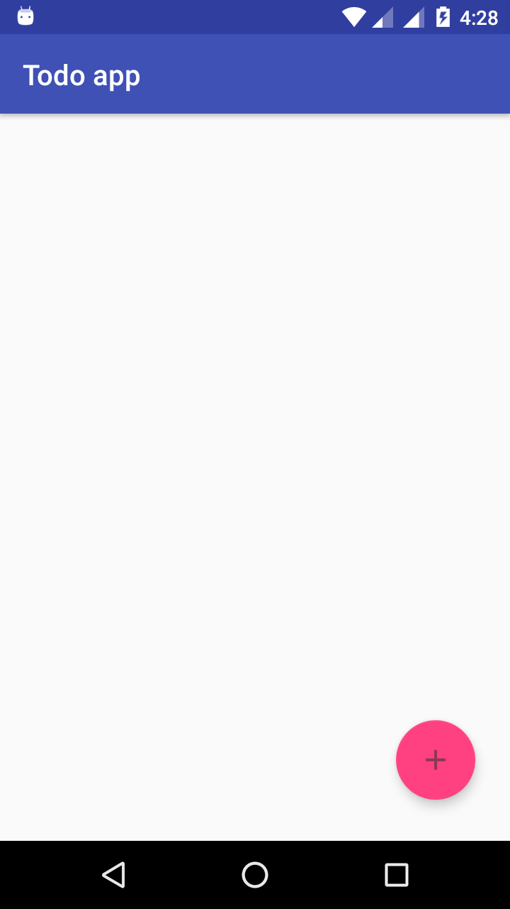
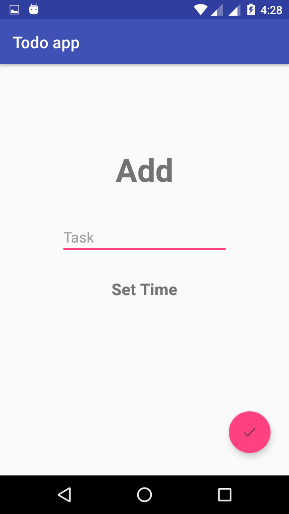
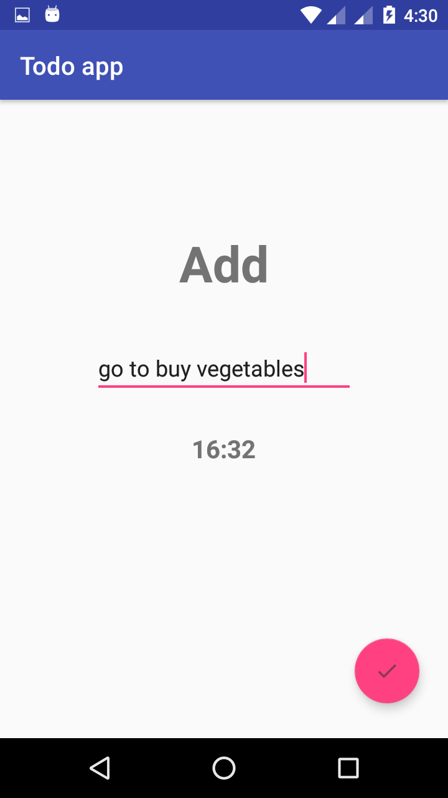
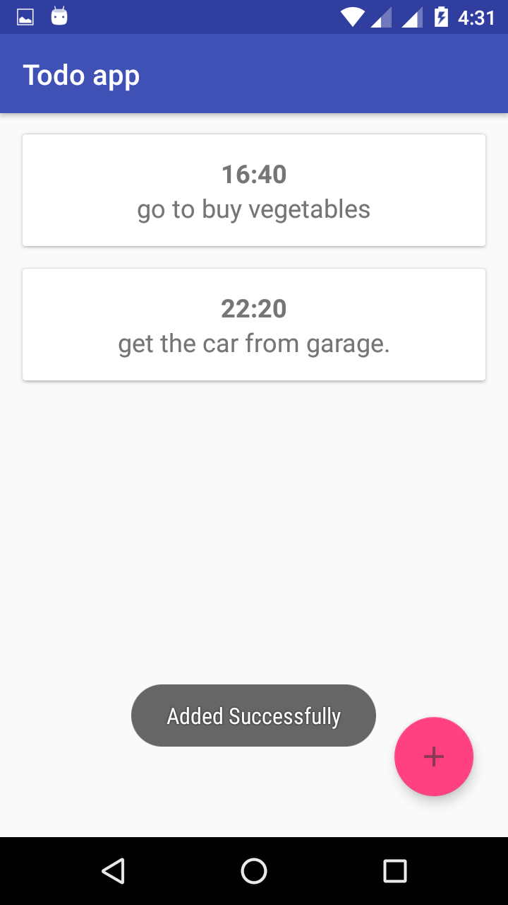
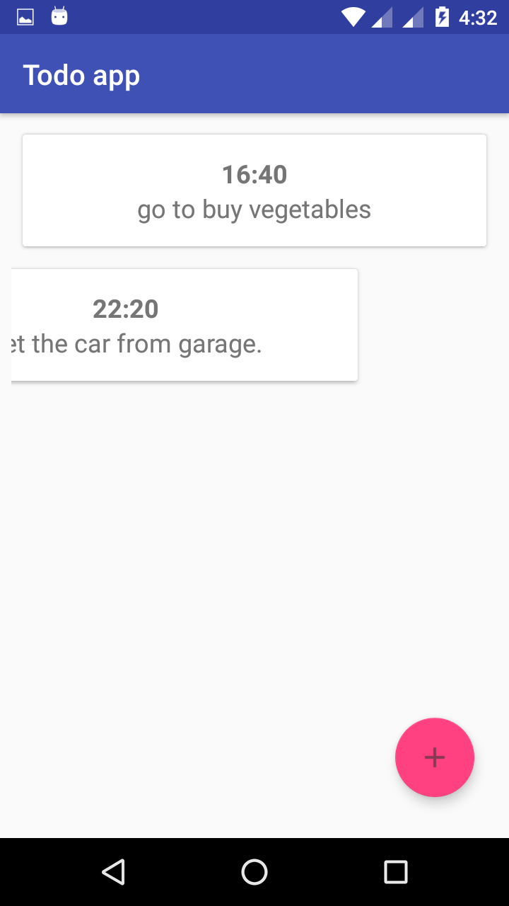

# Todo app (Android architecture components).

This is Todo app that save todo List and time. It show's you how to use Datetime Picker,CardView and Delete by swiping left.
**Repository pattern used and Thread Pool used**.

- Database Operation:-

 1) Insert.
 2) Delete.

### Note:-

Here we are using **LiveData instead of Loader**. We can use **LiveData instead of Loader**.
You can Check this documentation for Loader and LiveData [Click here](https://developer.android.com/guide/components/loaders).

### Question:-

1) Can we use **LiveData instead of Loader**? 
**Ans**:- Yes we can use **LiveData instead of Loader**.

- Android architecture components:-

 1) LiveData.
 2) ViewModel.
 3) Room Persistence Library. 
 
 ## Screenshots:- 
 
   
 
  
